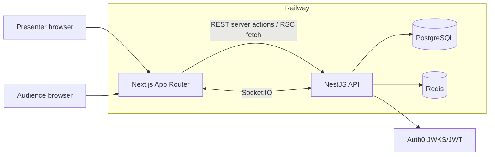
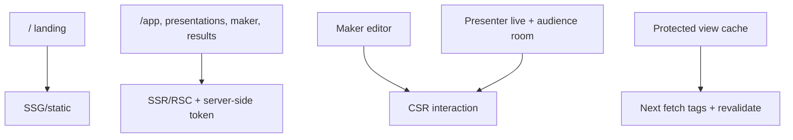
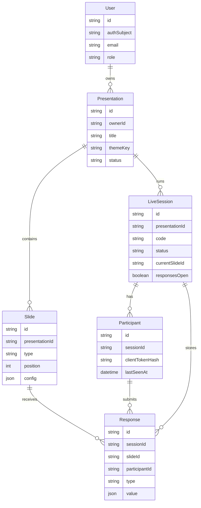
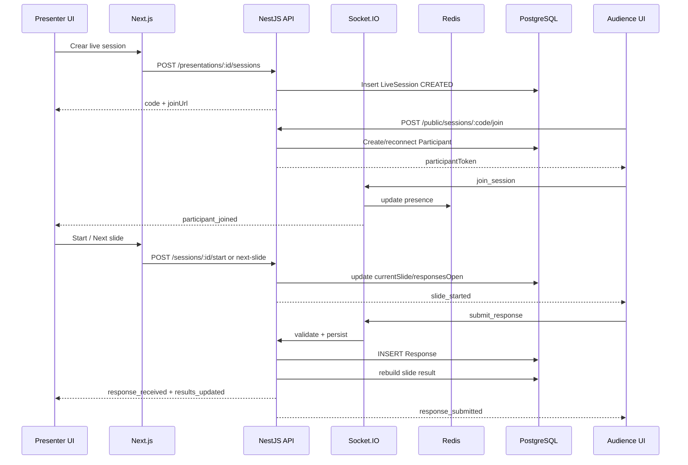
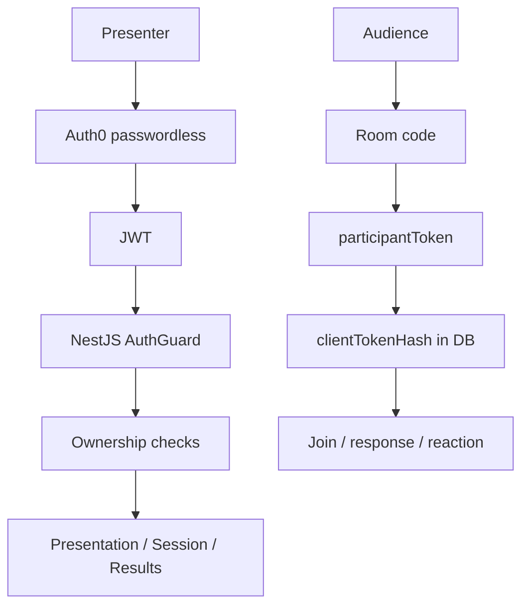
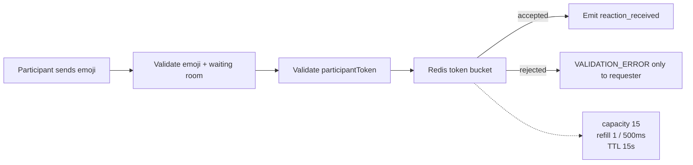

# Qaskly - punteo de presentacion

Secuencia sugerida: **intro -> stack -> arquitectura -> trade-offs -> demo -> cierre**.

Duracion objetivo: 10 minutos. Mantener la demo viva, pero usar los diagramas para explicar decisiones tecnicas sin perder tiempo buscando codigo.

## 1. Intro

### Mensaje principal

- Qaskly es una plataforma de presentaciones interactivas tipo Mentimeter.
- Problema: una presentacion tradicional tiene poca participacion y poco feedback medible.
- Solucion: presenter crea preguntas, comparte codigo/QR, audiencia responde y resultados aparecen en vivo.
- Presenter necesita cuenta; audiencia no, para bajar friccion.
- Flujo completo: crear -> presentar -> responder -> analizar.

### Punteo para decir

- "Construimos Qaskly para transformar una presentacion pasiva en una sesion participativa."
- "El presenter administra contenido y resultados, por eso usa auth."
- "La audiencia entra anonimamente por codigo, porque el valor esta en responder rapido."
- "La arquitectura esta pensada alrededor del flujo live, no como tecnologias sueltas."

## 2. Stack

| Capa | Tecnologia | Uso en Qaskly |
| --- | --- | --- |
| Frontend | Next.js App Router + React + TypeScript | Landing, dashboard, maker, live presenter, audience room, results |
| UI | Tailwind CSS + lucide-react + motion | Interfaz responsive, iconos, animaciones live |
| Backend | NestJS + TypeScript | REST API, Socket.IO gateway, ownership, validaciones |
| Realtime | Socket.IO | Join/leave, responses, live results, reactions |
| Estado efimero | Redis | Presencia, throttling, live state reconstruible |
| Persistencia | PostgreSQL + Prisma | Users, presentations, slides, sessions, participants, responses |
| Auth | Auth0 passwordless OTP | Sesion presenter, JWT para API owner-only |
| Contratos | `@qaskly/shared` | Tipos de slides, configs, responses, results y validaciones |
| Deploy | Railway | Web, API, Postgres, Redis y CD |

### Punteo para decir

- "PostgreSQL guarda la verdad durable; Redis guarda solo estado efimero."
- "Socket.IO no reemplaza la API REST; se usa donde necesitamos updates inmediatos."
- "El paquete shared evita duplicar validaciones entre front y back."
- "Auth0 nos da passwordless y JWT verificable desde NestJS."

## 3. Arquitectura

### 3.1 Diagrama general

### Punteo para decir

- "Next.js sirve presenter y audience."
- "Las acciones durables van por REST: crear, editar, iniciar, cerrar, avanzar."
- "Los eventos live van por Socket.IO: audiencia conectada, respuestas, resultados y reacciones."
- "Auth0 protege presenter; audience usa token anonimo por sala."
- "Postgres es fuente de verdad; Redis es auxiliar y reconstruible."

### 3.2 Patrones de renderizado

| Parte | Patron | Por que |
| --- | --- | --- |
| Landing | SSG/static | Carga rapida, contenido publico |
| Dashboard/maker/results | SSR/RSC | Datos protegidos, token server-side |
| Maker editor | CSR | Estado local, formularios, preview |
| Live presenter/audience | CSR + Socket.IO | Realtime e interaccion inmediata |
| Vistas protegidas | Cache tags | Reusar datos estables e invalidar tras mutaciones |

### Punteo para decir

- "No usamos CSR para todo: vistas protegidas cargan datos server-side."
- "El token de API del presenter no queda expuesto al browser."
- "Live queda fuera del cache porque necesita estado fresco."

### 3.3 Modelo de datos ERD

### Punteo para decir

- "Tenemos mas de 4 entidades reales del dominio, no tablas infladas."
- "Presentation y Slide representan authoring."
- "LiveSession, Participant y Response representan ejecucion live."
- "Response tiene unicidad por session, slide y participant para evitar doble respuesta."
- "Reactions no son entidad porque son live-only; no aportan al historico."

### 3.4 Flujo live

### Punteo para decir

- "Presenter lifecycle es REST porque son cambios durables y owner-only."
- "Audience responde por socket para feedback inmediato."
- "Cada respuesta se valida con contratos shared antes de guardarse."
- "El resultado se recalcula desde Postgres, evitando cache stale."

### 3.5 Seguridad y ownership

### Punteo para decir

- "Presenter: identidad fuerte via Auth0 JWT."
- "Audience: identidad anonima limitada a una sala."
- "Guardamos hash del participant token, no el token plano."
- "El backend valida ownership en cada recurso sensible."

### 3.6 Throttling y reacciones

### Punteo para decir

- "Las reacciones solo existen en waiting room."
- "No se guardan en Postgres, son efectos visuales live-only."
- "Cada participant tiene token bucket en Redis."
- "Burst 15, refill 1 cada 500 ms, TTL 15 segundos."
- "Si alguien spamea, se rechaza solo a ese socket; presenter no recibe basura."

## 4. Trade-offs

### Tabla principal

| Decision | Elegimos | Alternativas | Por que | Costo asumido |
| --- | --- | --- | --- | --- |
| Auth | Auth0 passwordless | Clerk, Supabase Auth, auth propia | OTP sin passwords, JWT estandar, integracion robusta con NestJS | Config externa, dependencia del correo OTP |
| Realtime | REST + Socket.IO | Todo WS, polling, SSE | REST para acciones durables; WS para eventos live bidireccionales | Dos canales que documentar/testear |
| DB | PostgreSQL + Prisma | MongoDB, Firestore, Supabase-only | Relaciones claras, constraints, ownership, resultados historicos | Schema/migraciones mas estrictos |
| Estado efimero | Redis | Solo Postgres, memoria Node | Presence/throttle/live cache rapido y no durable | Servicio extra que operar |
| Results | Recalcular desde responses | Guardar agregados, cache Redis | Evita stale data; simple para escala de curso | Para audiencias grandes conviene incremental/debounce |
| Reactions | Live-only sin tabla | Persistir analytics | Menos escritura, menos ruido, UX inmediata | No hay historico de emojis |
| Freeze | Congelar slides tras live | Permitir editar siempre | Consistencia entre preguntas y resultados | Se duplica para editar nueva version |
| API | REST | GraphQL | Acciones del dominio simples, menos overhead | No suma bonus GraphQL |
| Jobs | Sin queue | BullMQ/Rabbit/SQS | No hay trabajos pesados reales | Sin bonus de cola |
| Shared contracts | `@qaskly/shared` | Validar separado front/back | Una fuente para slide configs/responses/results | Paquete compartido agrega disciplina de versionado |

### Punteo por trade-off

#### Auth0 vs Clerk/Supabase/Auth propia

- Auth0 da passwordless OTP y JWT verificable desde backend.
- Clerk era comodo para UI, pero menos necesario para una API owner-only en NestJS.
- Auth propia descartada por seguridad y tiempo.
- Trade-off: hay que configurar tenant/callbacks/audience.

#### REST + Socket.IO vs todo WebSocket

- REST: lifecycle presenter, CRUD, results historicos.
- Socket.IO: audience join, responses, live results, reactions.
- Polling generaria latencia y requests innecesarios.
- SSE no era ideal porque audience tambien envia eventos.
- Todo WS haria mas dificil testear acciones durables.

#### PostgreSQL + Redis

- PostgreSQL guarda datos que deben sobrevivir.
- Redis guarda datos que pueden reconstruirse o expirar.
- Esto separa "verdad del negocio" de "estado live".
- Si Redis falla, no se pierden presentations/responses/results.

#### Throttling

- Responses: throttle simple por participant/session para evitar spam.
- Reactions: token bucket con burst controlado.
- 40 usuarios en demo deberian aguantar bien.
- Para cientos de usuarios, optimizar results con debounce/agregados incrementales.

#### Freeze de contenido

- Evita que resultados historicos apunten a preguntas cambiadas.
- Simplifica auditoria y explicacion del producto.
- Costo: editar requiere duplicar.
- Es una decision de consistencia, no una limitacion accidental.

## 5. Demo

### Secuencia corta

1. Landing: explicar producto en 15 segundos.
2. Login presenter o sesion ya iniciada.
3. Dashboard: abrir/crear presentation.
4. Maker: crear o editar 2 slides.
5. Theme: cambiar tema visual.
6. Live: crear session y mostrar codigo/QR.
7. Audience: entrar desde incognito o segundo browser.
8. Waiting room: mandar emojis.
9. Start: iniciar presentacion.
10. Audience: responder slide.
11. Presenter: mostrar participant count + results live.
12. Cerrar/avanzar slide.
13. Terminar session.
14. Results: abrir historico.
15. Maker read-only: mostrar freeze y duplicar.

### Que no olvidar decir durante la demo

- "Esto esta pasando con dos clientes conectados al mismo backend."
- "Audience no tiene cuenta; su identidad es un token anonimo por sala."
- "La respuesta queda en Postgres; el resultado live se emite por socket."
- "Las reacciones no quedan guardadas; son estado live efimero."
- "El contenido se congela al presentar para proteger resultados historicos."

### Plan B

| Si falla | Hacer |
| --- | --- |
| Auth0 OTP | Usar sesion ya autenticada y explicar AuthGuard/JWT |
| Produccion | Mostrar API health + codigo + README diagrams |
| Socket.IO | Mostrar que REST/results siguen; explicar gateway y durable state |
| Tiempo corto | Usar presentation prearmada y saltar creacion desde cero |
| Audience lenta | Responder desde una sola ventana y explicar que escala a mas sockets |

## 6. Cierre

### Punteo final

- Qaskly cumple un flujo completo: crear, presentar, responder y analizar.
- Las decisiones tecnicas nacen del producto: auth para presenter, anonimo para audience, realtime para participacion, DB para historico.
- La arquitectura separa datos durables y estado efimero.
- Se priorizo calidad y coherencia por sobre sumar tecnologias decorativas.
- Mejoras futuras: agregados incrementales, Redis adapter de Socket.IO para multi-instancia, settings profile UI y analytics de participacion.

### Frase de cierre

"La idea principal es que Qaskly no solo usa realtime como adorno: el realtime es la experiencia central del producto, y la arquitectura esta construida para sostener ese flujo sin perder persistencia, seguridad ni trazabilidad."

## Q&A rapido

| Pregunta | Respuesta corta | Archivo para abrir |
| --- | --- | --- |
| Donde esta auth? | Auth0 protege presenter; API valida JWT y ownership. | `apps/api/src/auth/auth.guard.ts` |
| Como evitan acceso ajeno? | Ownership checks antes de leer/mutar recursos. | `apps/api/src/common/ownership.ts` |
| Por que Redis? | Presence/throttle/live cache efimero. | `apps/api/src/redis/redis.service.ts` |
| Por que no guardar reactions? | Son feedback visual live-only, no resultado historico. | `apps/api/src/responses/reactions.service.ts` |
| Como validan responses? | Contratos shared por tipo de slide. | `packages/shared/src/slides/*` |
| Que pasa si se reconecta audience? | Reusa participantToken y conserva identidad. | `apps/api/src/participants/participants.service.ts` |
| Por que freeze? | Consistencia entre respuestas historicas y preguntas. | `apps/api/src/slides/slides.service.ts` |
| Aguanta 40 personas? | Si para demo; bottleneck futuro seria agregacion live. | `apps/api/src/results/results.service.ts` |
| Por que no GraphQL? | REST cubre mejor acciones simples del dominio. | `README.md` |
| Que mejorarian? | Agregados incrementales y Socket.IO Redis adapter multi-instancia. | `docs/presentation-guide.md` |

## Checklist antes de presentar

- [ ] Presenter ya autenticado.
- [ ] Presentation demo lista con 2-3 slides.
- [ ] Ventana audience/incognito preparada.
- [ ] API health abierto.
- [ ] README abierto en arquitectura/renderizado.
- [ ] Esta guia abierta en trade-offs.
- [ ] Zoom del navegador legible.
- [ ] Un integrante maneja demo y otro explica arquitectura.
- [ ] Tener listo que mostrar si preguntan por Auth0, Redis, freeze y throttling.
