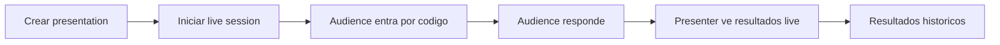
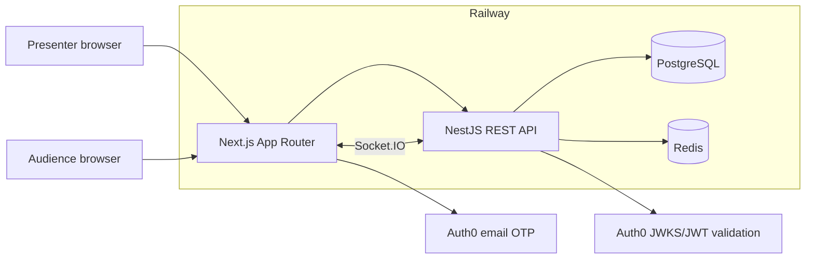
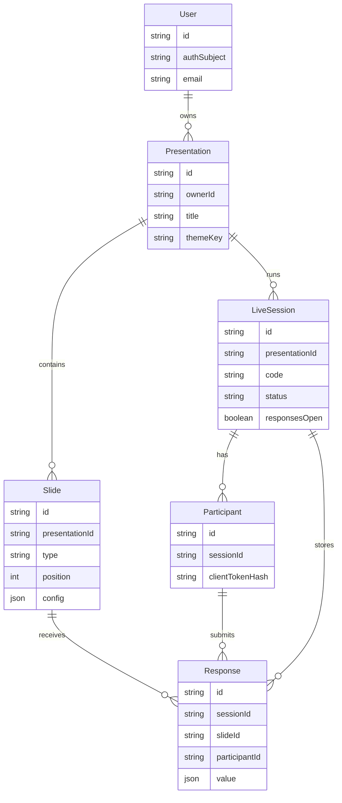
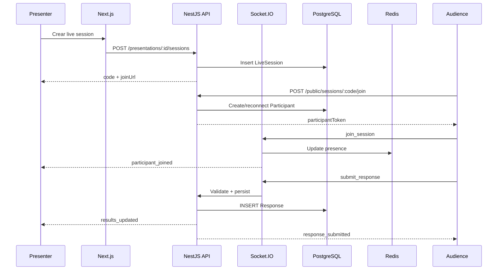
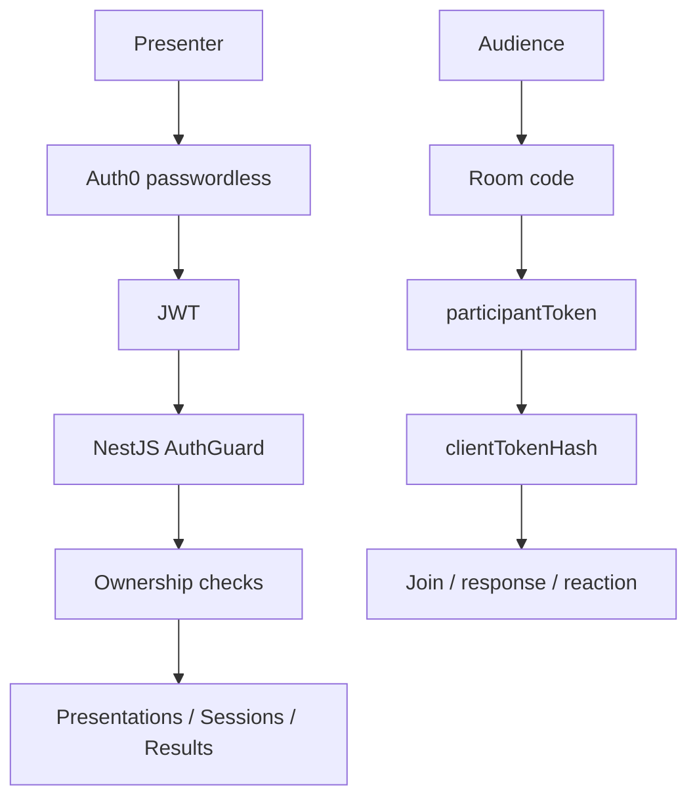

# Qaskly

Presentaciones interactivas en tiempo real.

---

## 1. Intro

- Plataforma tipo Mentimeter para sesiones participativas.
- Presenter crea preguntas, comparte codigo/QR y controla la sesion.
- Audience entra sin cuenta, responde desde el celular y ve una experiencia simple.
- Resultados live e historicos para revisar participacion.

---

## Flujo principal

---

## 2. Stack

| Capa | Tecnologia |
| --- | --- |
| Frontend | Next.js App Router, React, TypeScript, Tailwind, Visx |
| Backend | NestJS, REST API, Socket.IO |
| Persistencia | PostgreSQL, Prisma |
| Realtime/efimero | Socket.IO, Redis |
| Auth | Auth0 passwordless OTP |
| Contratos | `@qaskly/shared` |
| Deploy | Railway |

---

## 3. Arquitectura general

---

## Decisiones de arquitectura

- REST para acciones durables: CRUD, start, next, close, end.
- Socket.IO para eventos live: join, responses, results, reactions.
- PostgreSQL como fuente de verdad durable.
- Redis para presencia, throttling y estado efimero.
- Auth0 protege presenter; audience usa token anonimo por sala.

---

## Patrones de renderizado

| Parte | Patron | Motivo |
| --- | --- | --- |
| Landing | Static/SSG | Contenido publico y carga rapida |
| Dashboard/maker/results | SSR/RSC | Datos protegidos y token server-side |
| Maker editor | CSR | Estado local y preview interactivo |
| Live presenter/audience | CSR + Socket.IO | Realtime sin reload |
| Vistas protegidas | Fetch cache tags | Reuso controlado e invalidacion |

---

## 4. Modelo de datos

---

## Flujo live

---

## Seguridad

---

## 5. Trade-offs

| Decision | Elegimos | Alternativas | Trade-off |
| --- | --- | --- | --- |
| Auth | Auth0 passwordless | Clerk, Supabase, auth propia | Robustez y JWT; mas configuracion externa |
| Realtime | REST + Socket.IO | Todo WS, polling, SSE | Mejor separacion; dos canales |
| Datos | PostgreSQL + Prisma | NoSQL | Relaciones fuertes; schema mas rigido |
| Efimero | Redis | Solo Postgres, memoria Node | Mejor presence/throttle; servicio extra |
| Results | Recalcular desde responses | Agregados persistidos | Simple y consistente; menos optimo a gran escala |
| Reactions | Live-only | Persistir analytics | Menos escritura; sin historico de emojis |
| Freeze | Congelar slides tras live | Editar siempre | Consistencia historica; editar exige duplicar |
| API | REST | GraphQL | Menos overhead; sin bonus GraphQL |

---

## Trade-offs clave

- Auth0: passwordless y JWT confiable, a cambio de dependencia externa.
- REST + Socket.IO: REST mantiene acciones testeables; sockets entregan feedback inmediato.
- PostgreSQL + Redis: separa verdad durable de estado efimero.
- Throttling: token bucket en Redis para evitar spam de reactions.
- Freeze: protege resultados historicos frente a ediciones posteriores.

---

## 6. Demo

1. Abrir Qaskly y explicar landing.
2. Entrar como presenter.
3. Crear o abrir una presentation.
4. Crear/editar slides.
5. Cambiar theme.
6. Iniciar live session.
7. Entrar como audience por codigo/QR.
8. Enviar reactions en waiting room.
9. Responder una slide.
10. Ver results live en presenter.
11. Cerrar/avanzar.
12. Terminar session.
13. Ver results historicos.
14. Mostrar freeze y duplicar.

---

## 7. Cierre

- Qaskly cubre el flujo completo: crear, presentar, responder y analizar.
- Las tecnologias responden al producto, no son decorativas.
- Auth protege al presenter; audience mantiene baja friccion.
- PostgreSQL conserva resultados; Redis acelera realtime.
- Futuro: agregados incrementales, Socket.IO Redis adapter multi-instancia, settings UI y analytics.

---

## Aprendizaje principal

Separar datos durables de estado efimero simplifica el sistema:

- PostgreSQL guarda la historia.
- Redis maneja lo transitorio.
- Socket.IO sincroniza la experiencia.
- REST mantiene acciones criticas faciles de probar.

